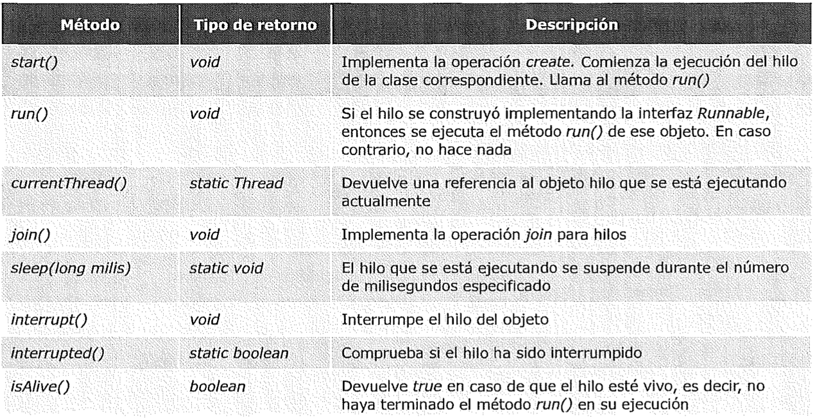

| [Inicio](../README.md) |      | [Hilos](I.INDICE.MD) |
| ---------------------- | ---- | -------------------: |
|                        |      |                      |

# HILOS EN JAVA

En Java, un hilo se representa mediante una instancia de la clase **java.lang.thread**. Este objeto thread se emplea para iniciar, detener o cancelar la ejecución del hilo de ejecución.

Los hilos o threads se pueden implementar o definir de dos formas:

- **Extendiendo la clase thread.**
- **Mediante la interfaz Runnable.**

En ambos casos, se debe proporcionar una definición del método *run*(), ya que este método es el que contiene el código que ejecutará el hilo, es decir, su comportamiento.

Extender la clase thread es el procedimiento más sencillo, pero no siempre es posible. Si la clase ya hereda de alguna otra clase padre, no será posible heredar también de la clase thread (recuerda que Java no permite la herencia múltiple), por lo que habrá que recurrir al otro procedimiento.

Implementar Runnable siempre es posible, es el procedimiento más general y también el más flexible.

Para saber qué hilo se está ejecutando en un momento dado, utilizamos el método *currentThread*() y obtenemos su nombre invocando al método *getName*(), ambos de la clase thread.

### PROCESO DE CREACIÓN DE HILOS

1. ***Creación de hilos extendiendo la clase Thread.\***

   Para definir y crear un hilo extendiendo la clase thread, haremos lo siguiente:

   - Crear una nueva clase que herede de la clase thread.
   - Redefinir en la nueva clase el método run() con el código asociado al hilo.
   - Crear un objeto de la nueva clase thread. Éste será realmente el hilo.
   - Una vez creado el hilo, para ponerlo en marcha o iniciarlo invocamos al método *start*() del objeto thread.

   El siguiente código define una clase Hilo1 que extiende Thread

```java
public class Hilo1 extends Thread {
	
	//Constructor
	public Hilo1(String nombre) { 
    //mediante esta instrucción, le decimos al constructor el 
    //nombre del hilo usando el constructor de la clase Thread
    //asi podemos obtener su nombre con el método existente getName()
		super(nombre);
		System.out.println("CREANDO HILO: " + getName());
	}

	// metodo run
	public void run() {
		for (int i=0; i<5; i++) 
			System.out.println("Hilo:" + getName() + " C = " + i);
	}
}
```

El programa principal debe crear y ejecutar dicho hilo de la siguiente manera:

```java
public static void main(String[] args) {
		//Creamos las instancias de los tres hilos
		Hilo1 h1 = new Hilo1("Hilo 1");
		Hilo1 h2 = new Hilo1("Hilo 2");
		Hilo1 h3 = new Hilo1("Hilo 3");
			
		//Los ejecutamos
		h1.start();
		h2.start();
		h3.start();

}
```

### CLASE THREAD: MÉTODOS SOBRE HILOS

Algunos de los métodos mas comunes sobre hilos son los que se muestran en la tabla b), donde podemos encontrar los métodos mas comunes para el manejo y a planificación de hilos.



Tabla b). Métodos de hilos de la clase Thread

Un magnífico sitio donde puedes entender la programación multihilos en java es el siguiente:

https://jarroba.com/multitarea-e-hilos-en-java-con-ejemplos-thread-runnable/

